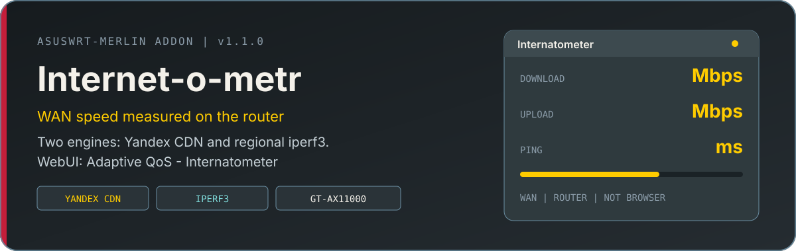
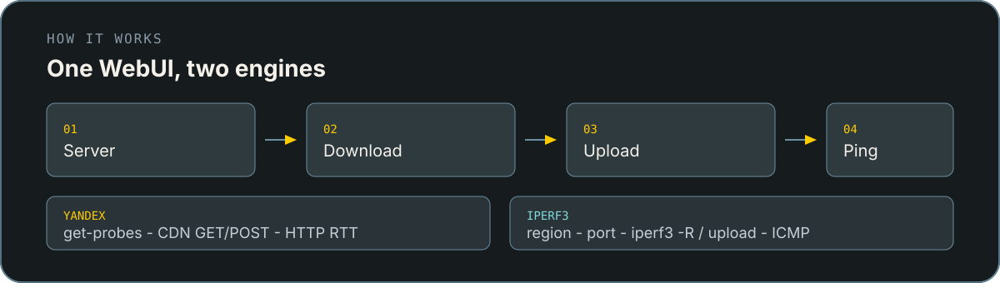

<p align="center">
  
</p>

Аддон для [Asuswrt-Merlin](https://www.asuswrt-merlin.net/): вкладка **Интернетометр** в WebUI. Замер идёт **на WAN роутера**, не в браузере ПК.

Два режима в одной вкладке:

- **Yandex** — CDN [Яндекс Интернетометра](https://yandex.ru/internet)
- **iPerf3** — TCP к публичным серверам ЭР-Телеком, МТС, Hostkey и др., с выбором региона


| | |
|---|---|
| Версия | **1.1.0** |
| Платформа | Asuswrt-Merlin `384.15+` / `3004+` / `3006+` |
| Проверено | GT-AX11000 (ROG) |
| Yandex | штатный `curl` + BusyBox, Entware не нужен |
| iPerf | нужен `iperf3` (`opkg install iperf3`) |
| Хуки | `#internetometr` ([Addons API](https://github.com/RMerl/asuswrt-merlin.ng/wiki/Addons-API)) |

<p align="center">
  
</p>

## Что умеет

- вкладка **Интернетометр** в Adaptive QoS (рядом с Internet Speed; запасной вариант — Tools)
- Download, Upload, ping и внешний IPv4
- каталог региональных iperf-серверов
- CLI: `install` / `uninstall` / `remount` / `run` / `run iperf <id>` / `version`

## Установка

Архив `asuswrt-merlin-internetometr.tar.gz` из [Releases](https://github.com/vilture/asuswrt-merlin-internetometr/releases).

С ПК (подставьте SSH-порт и IP):

```sh
scp -O -P <PORT> asuswrt-merlin-internetometr.tar.gz user@<IP>:/tmp/
```

На роутере (если стояла старая сборка `yandexspeed` — сначала удалите её):

```sh
[ -x /jffs/scripts/yandexspeed ] && /jffs/scripts/yandexspeed uninstall
cd /tmp
rm -rf /jffs/addons/internetometr
tar -xzf asuswrt-merlin-internetometr.tar.gz -C /jffs/addons
mv /jffs/addons/internetometr/internetometr /jffs/scripts/internetometr
chmod 0755 /jffs/scripts/internetometr
sh /jffs/scripts/internetometr install
```

Для iPerf:

```sh
opkg update
opkg install iperf3
```

Затем **выйдите и войдите** в WebUI → **Adaptive QoS** → **Интернетометр**.

Сборка из исходников:

```sh
sh build.tar.sh
```

## Обновление и удаление

Чистая переустановка:

```sh
/jffs/scripts/internetometr uninstall
# затем снова «Установка»
```

Замена файлов без uninstall:

```sh
cd /tmp
tar -xzf asuswrt-merlin-internetometr.tar.gz
cp internetometr/internetometr /jffs/scripts/internetometr
cp internetometr/_globals.sh internetometr/mount.sh internetometr/install.sh \
   internetometr/run_speedtest.sh internetometr/run_iperf.sh \
   internetometr/iperf_servers.sh internetometr/iperf_servers.list \
   internetometr/index.asp internetometr/internetometr.js \
   /jffs/addons/internetometr/
chmod 0755 /jffs/scripts/internetometr
/jffs/scripts/internetometr remount
```

## CLI

```sh
/jffs/scripts/internetometr version
/jffs/scripts/internetometr run
/jffs/scripts/internetometr run iperf nsk_er
/jffs/scripts/internetometr remount
```

| Путь | Назначение |
|------|------------|
| `/www/user/internetometr/result.json` | последний результат |
| `/www/user/internetometr/status.json` | прогресс для UI |
| `/www/user/internetometr/request.json` | engine / server_id |
| `/tmp/internetometr.log` | лог |

## Ограничения

- неофициальный API Яндекса может измениться
- без `iperf3` режим iPerf не стартует
- ICMP на части хостов закрыт
- замер грузит CPU и WAN ~20–40 с; NAND / bootloader не трогается

Файлы только в `/jffs`, `/tmp` и `/www/user/internetometr/`.

## Лицензия

На свой страх и риск. Не связан с Яндексом и ASUS.
